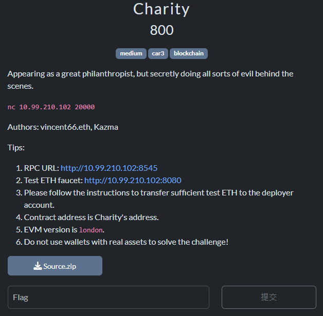

# CGGC 2024 Final Writeup - Charity

The infrastructure was provided by [SolidCTF](https://github.com/chainflag/solidctf/).

## The Challenge

## Source Codes

- `Charity.sol`: Provides `getAlms`, `donate`, `withdraw`, and `flashLoan` functions.
  - `getAlms`: Will mint 10 CGGC tokens to `msg.sender`.
  - `donate`: Donate `amount` CGGC token to `Charity`, and `msg.sender` will receive an ERC721 NFT.
  - `withdraw`: Withdraw the donated token based on `tokenID`, and it verifies if `msg.sender` is the NFT owner.
  - `flashLoan`: `msg.sender` can borrow CGGC tokens from `Charity`, and the callback function is `flashCallback`.
- `CGGCtoken.sol`: An ERC20 token contract.
- `KINDnft.sol`: An ERC721 NFT contract.

## Pass Conditions

1. The balance of CGGC token in `Charity` == 0.
2. tokenID > 0 (At least one NFT was minted).
